# 텍스트 검색 기반 장면 탐색 AI

> Tving Hackathon, CV-15 핑핑이들  
> 주제, 장면 탐색을 위한 Video to Text / Text to Video 모델  
> 부제, Find the clips you want: Based on text


## 1. 프로젝트 개요

동영상 콘텐츠에서 원하는 장면을 텍스트로 검색할 수 있도록, 비디오 클립을 자연어 캡션으로 변환하고 사용자의 검색 문장과 가장 유사한 장면을 찾아 반환하는 시스템을 구축했습니다.

핵심 기능은 두 가지입니다.

첫째, **Video to Text**는 비디오를 작은 클립으로 나누고 각 클립의 내용을 캡션으로 변환합니다. 이를 통해 긴 영상을 텍스트 DB 형태로 관리할 수 있어 검색과 저장 효율을 높일 수 있습니다.

둘째, **Text to Video**는 사용자가 입력한 문장을 임베딩으로 변환하고, 미리 구축된 캡션 임베딩 DB에서 가장 유사한 비디오 클립과 timestamp를 검색합니다.

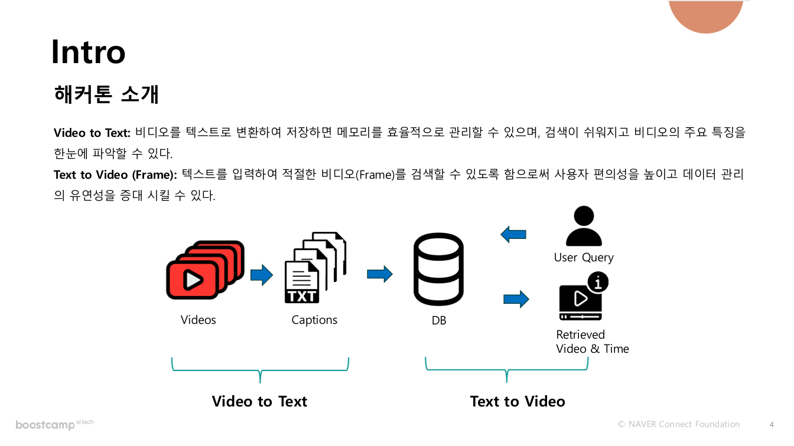

## 0. 주요 성과

- YouTube-8M Movieclips 기반 1,218개 영상 데이터 수집 및 분석
- Tarsier-7B 기반 클립별 캡션 생성 파이프라인 구축
- 서버 4대를 활용한 GPU 분산 처리로 캡셔닝 처리 속도 개선
- all-mpnet-base-v2 기반 문장 임베딩 및 검색 DB 구축
- 캡션-쿼리 쌍 429개를 활용한 임베딩 모델 fine-tuning
- Recall@1 기준 Base 19.25%에서 Trained 20.86%로 개선
- 최종 DB에서 Trained model + 3s + 5s + 7s 조합으로 Recall@1 21.39%, 평균 유사도 0.7696 달성
- Video to Text, Text to Video Web Demo 구현

## 2. 팀 구성 및 역할

| 이름 | 역할 |
|---|---|
| 정현우 | 전체 파이프라인 및 실험 설계, Video-to-Text 코드 구현, 코드 최적화 |
| 박지완 | Text-to-Video embedding, retrieval 코드 구현, web demo 구현 |
| 최재훈 | 모델 탐색 및 전략 수립, 검색 성능 평가 실험, 최종 파이프라인 구축 및 정리 |
| 임찬혁 | 데이터 전처리, captioning 및 query DB 구축, embedding 모델 fine-tuning 실험 |
| 민창기 | 모델 탐색, 모델 훈련 및 평가, 최종 파이프라인 구축, 오디오 캡셔닝 및 자막 모델 실험 |
| 이단유 | Video-to-Text 캡셔닝 모델 및 프롬프트 실험, 입력 query 생성 |

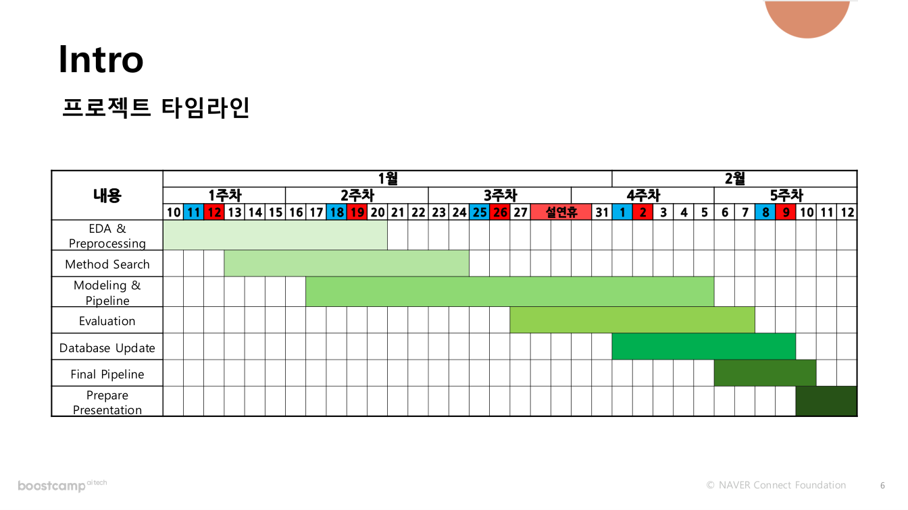

## 3. 데이터 수집 및 분석

YouTube-8M 데이터셋의 Movieclips 분야 URL 정보를 수집하고, 접근 가능한 영상을 직접 다운로드했습니다.

최종적으로 접근 불가능한 영상을 제외하고 **총 1,218개 영상**을 사용했습니다.

| 항목 | 평균 | 최소 | 최대 |
|---|---:|---:|---:|
| Duration, 초 | 166.62 | 97.62 | 487.94 |
| FPS | 24.11 | 18.00 | 30.00 |
| Width, px | 638.94 | 320.00 | 640.00 |
| Height, px | 358.54 | 240.00 | 360.00 |

분석 결과를 바탕으로 영상 처리 시간, 프레임 샘플링, 모델 입력 크기, 메모리 사용량을 고려해 파이프라인을 설계했습니다.

## 4. Video to Text 파이프라인

Video to Text 파이프라인은 입력된 비디오 정보, video id와 timestamp 구간을 기준으로 영상을 작은 클립으로 분할하고, 각 클립에 대해 캡셔닝 모델을 적용하여 자연어 설명을 생성합니다.

사용한 핵심 모델은 **Tarsier-7B**입니다. Tarsier는 비디오를 입력받아 질문에 답하는 Video Question Answering 모델이며, `Describe this video in detail.` 같은 프롬프트를 통해 클립별 캡션을 생성했습니다.

## 5. 캡셔닝 모델 비교

캡셔닝 모델은 정성 평가와 정량 평가를 함께 고려했습니다.

정성 평가는 5명의 평가자가 정확성, 포괄성, 간결성을 기준으로 평가했고, 정량 평가는 캡션 생성 소요 시간을 측정했습니다.

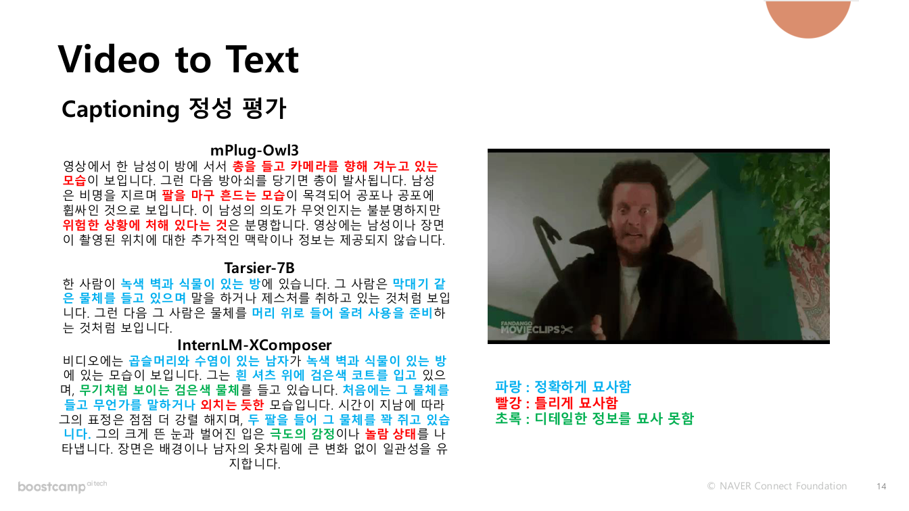

Tarsier-7B는 정성 평가 평균이 가장 높고, 소요 시간도 상대적으로 짧아 최종 캡셔닝 모델로 선택했습니다.

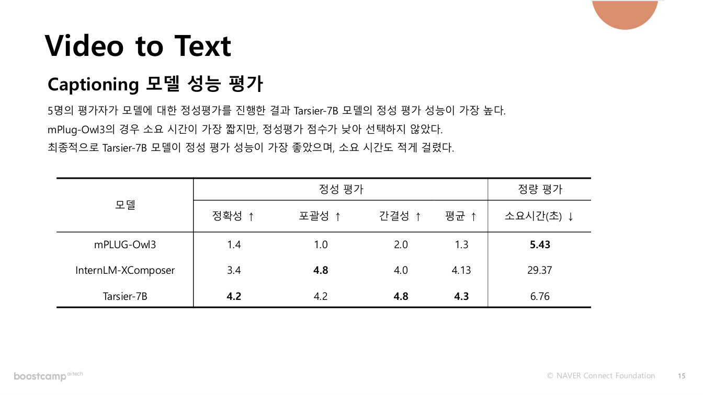

## 6. 분산 병렬 처리

캡셔닝 처리 속도를 높이기 위해 메인 서버의 비디오를 4개의 서버로 분할하여 처리했습니다.

각 서버는 할당된 비디오 클립을 분석하고 JSON 형식으로 캡션을 저장합니다. 이후 메인 서버에서 JSON을 병합하고 최종 DB를 업데이트하는 방식으로 구성했습니다.

이를 통해 대량 영상에 대한 캡셔닝 시간을 줄이고, JSON 기반으로 중간 결과를 유연하게 관리할 수 있었습니다.

## 7. Text to Video 파이프라인

Text to Video 파이프라인은 생성된 캡션을 문장 임베딩으로 변환하고, 사용자의 검색 문장도 같은 방식으로 임베딩한 뒤 벡터 DB에서 유사한 캡션을 검색합니다.

검색 결과로는 관련 비디오 ID와 timestamp 구간을 반환합니다.

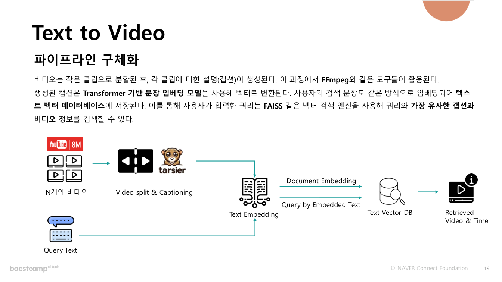

## 8. 평가용 쿼리 생성

검색 성능을 평가하기 위해 직접 평가용 쿼리와 정답 비디오 구간을 구축했습니다.

쿼리는 아래 템플릿을 기준으로 작성했습니다.

```text
[날씨] [시간대], [배경], [배경의 상태/특성], [특징]의 [사람/동물/사물]이(가) [상호작용/동작] 장면
```

예시는 다음과 같습니다.

```text
비 오는 낮, 시멘트 바닥, 배경에 나무, 청자켓을 입은 남자와 여름 교복을 입은 여학생이 한 우산을 같이 쓰고 있는 장면
```

## 9. 임베딩 모델 평가

Tarsier-7B로 생성된 캡션을 기준으로 187개의 캡션-쿼리 쌍을 직접 작성하고, 각 쿼리에 대해 정답 캡션이 Top N 결과 안에 포함되는지 평가했습니다.

all-mpnet-base-v2는 Recall@20과 평균 순위가 가장 좋아 최종 임베딩 모델로 선택했습니다.

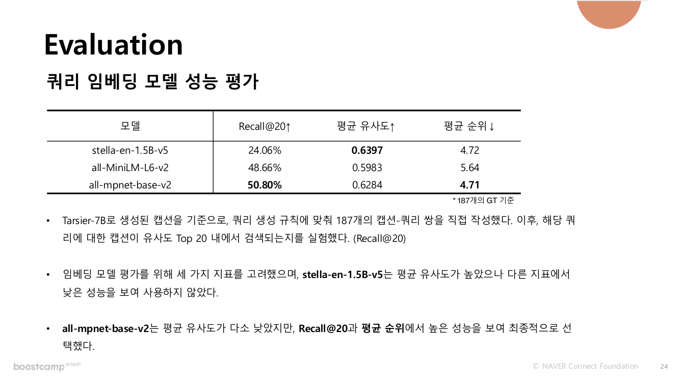

## 10. 임베딩 모델 Fine-tuning

검색 성능을 높이기 위해 all-mpnet-base-v2를 프로젝트 데이터셋에 맞게 fine-tuning했습니다.

Tarsier-7B로 생성된 캡션을 기반으로 429개의 캡션-쿼리 쌍을 만들고, 이를 Positive Sample로 활용해 학습했습니다.

Fine-tuning 결과 Recall@3은 약 7%p, Recall@1은 약 1%p 상승했고 평균 유사도는 약 15% 증가했습니다.

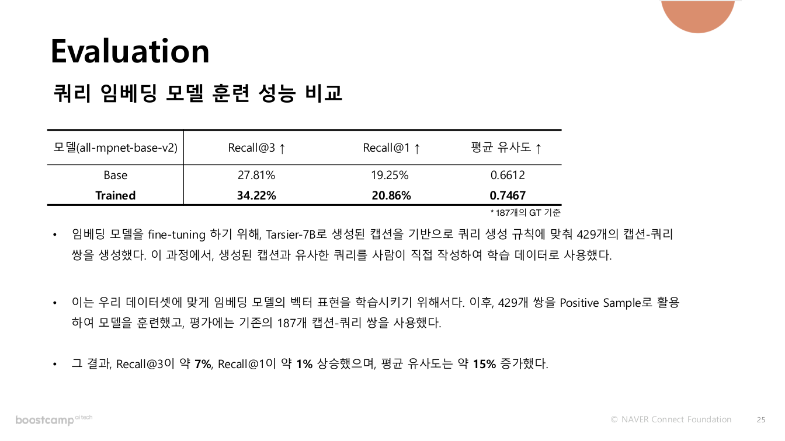

## 11. 비디오 분할 방법 비교

영상 검색 DB를 구축하기 위해 비디오를 여러 방식으로 분할했습니다.

실험한 방법은 다음과 같습니다.

- PySceneDetect ContentDetector
- PySceneDetect AdaptiveDetector
- OpenCV 기반 Shot Boundary 감지
- FFmpeg 기반 3초, 5초, 7초 단순 분할

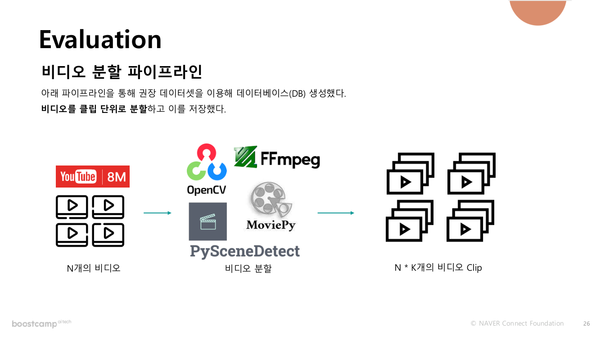

실험 결과, 장면 감지 기반 분할보다 FFmpeg를 이용한 단순 시간 단위 분할이 더 높은 검색 성능을 보였습니다.

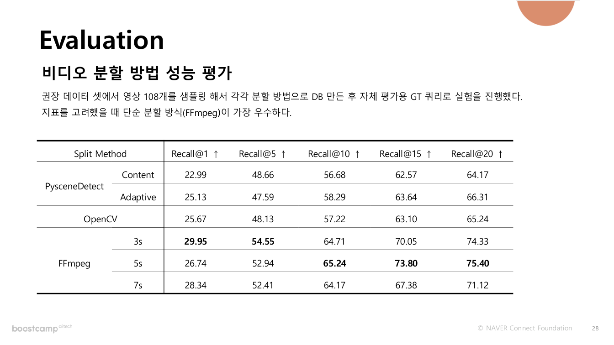

## 12. 최종 DB 성능

최종 DB는 모든 실험 결과를 반영해 구축했습니다. 1,218개 전체 영상에 대해 3초, 5초, 7초 분할 조합과 fine-tuned embedding model을 적용했습니다.

최종적으로 fine-tuned embedding model과 3s + 5s + 7s DB 조합에서 가장 높은 Recall@1과 평균 유사도를 얻었습니다.

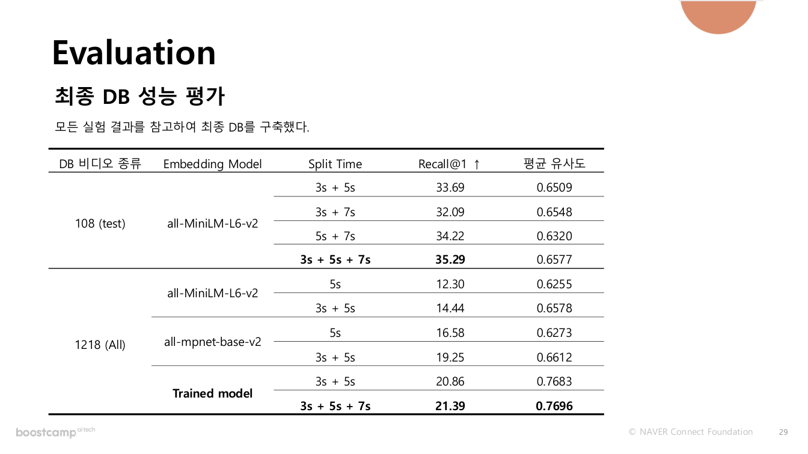

## 13. 최종 파이프라인

최종 시스템은 세 개의 흐름으로 구성됩니다.

1. **Video to Text Pipeline**  
   입력된 비디오 ID와 timestamp를 기준으로 클립을 분할하고 Tarsier-7B로 캡션을 생성합니다.

2. **DB Construct Pipeline**  
   YouTube-8M Movieclips와 외부 영상 데이터를 클립 단위로 나누고, 캡션을 임베딩하여 Text Vector DB를 구축합니다.

3. **Text to Video Pipeline**  
   사용자의 검색 문장을 임베딩하고, FAISS 기반 유사도 검색을 통해 관련 비디오와 timestamp를 반환합니다.

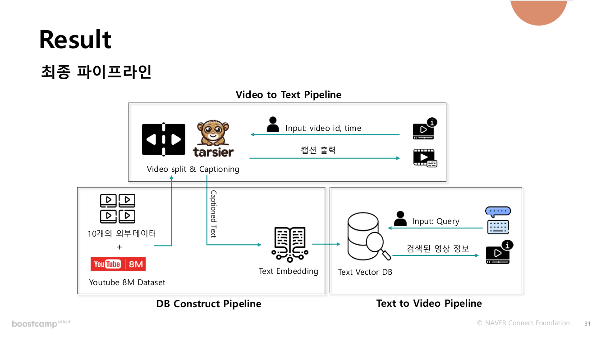

## 14. Web Demo

Video to Text와 Text to Video 기능을 웹 데모로 구현해 파이프라인 결과를 직접 확인할 수 있도록 했습니다.

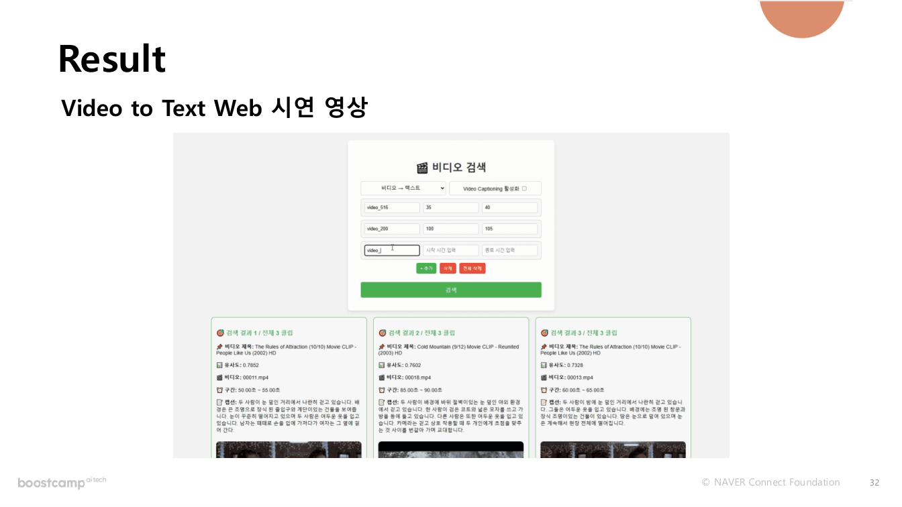

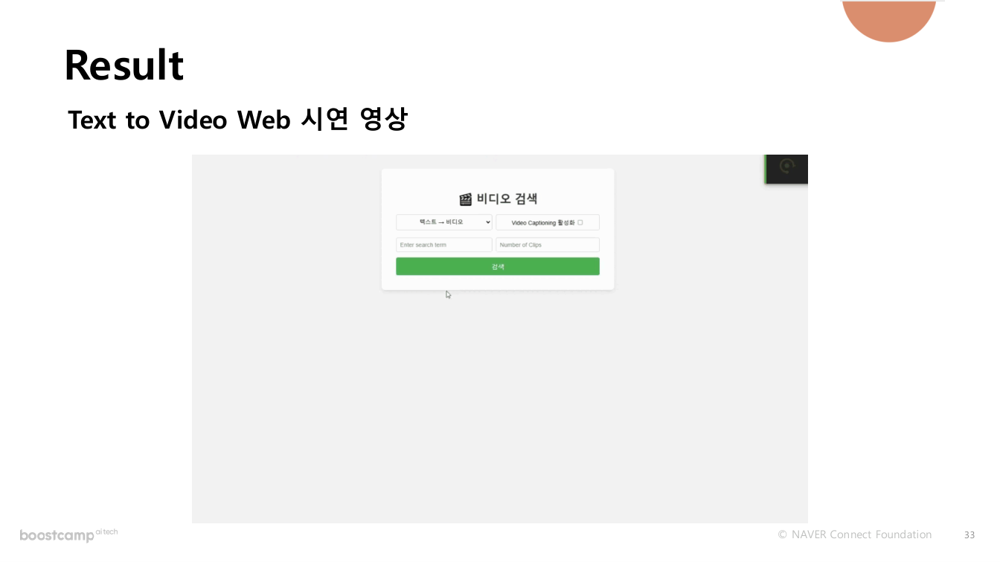

## 15. 개선 가능성

실제 서비스 환경에서는 오디오 캡셔닝과 자막 정보를 함께 활용하면 영상 검색 품질을 높일 수 있습니다. 또한 등장인물 이름 기반 검색을 위해 인물 인식 모델을 추가하거나, self-supervised learning 기반으로 캡션 및 임베딩 모델을 추가 학습하는 방향을 고려할 수 있습니다.
